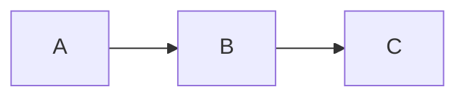
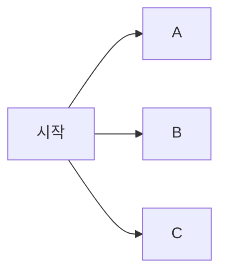
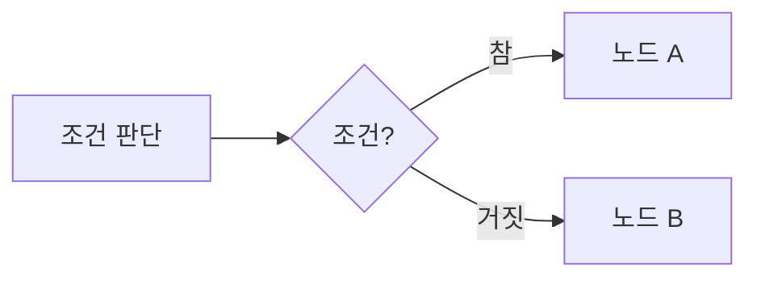
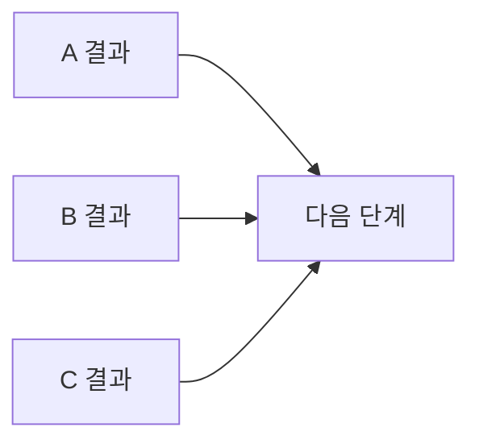
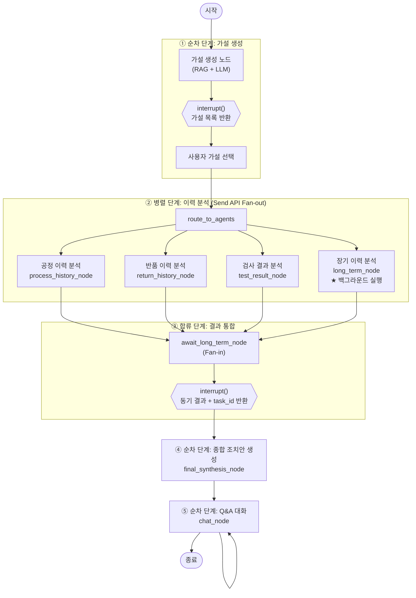
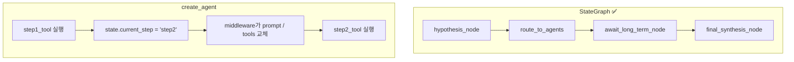
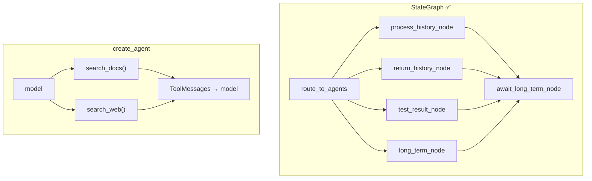
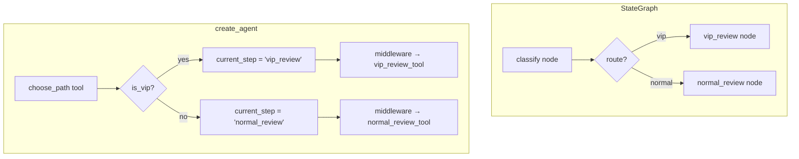
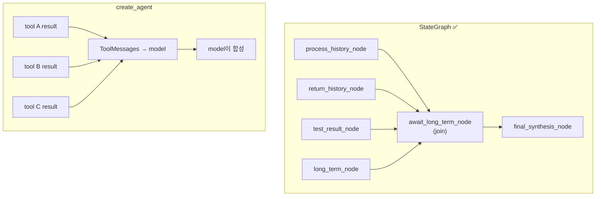
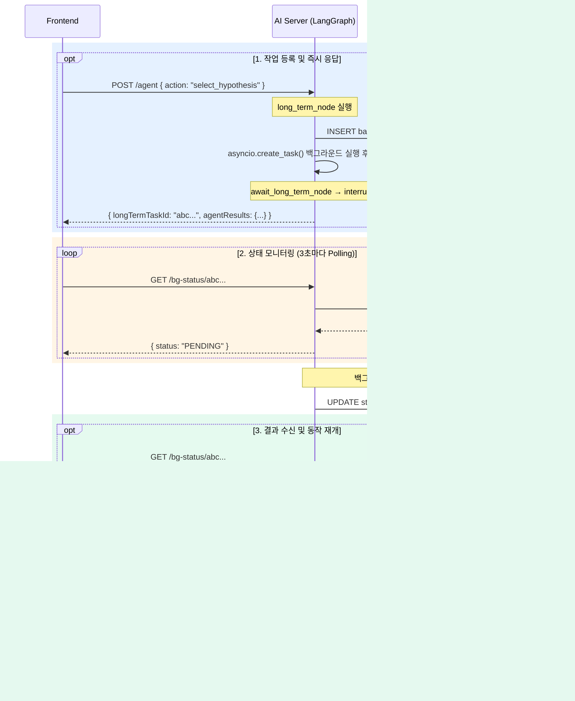

# Display Defect Chatbot — 발표 자료

---

## 1. 발표 개요

### 프로젝트 소개

> 삼성 디스플레이 패널 픽셀 불량을 AI가 진단하고 조치안을 생성하는 챗봇

- **입력**: 불량 증상, 제품 ID, 고객사
- **출력**: 가설 → 병렬 이력 분석 → 종합 조치안 → Q&A

---

### 발표 주제

| # | 주제 | 핵심 질문 |
|---|------|-----------|
| 2 | **Workflow 개요** | 이 프로젝트의 업무 흐름을 어떻게 모델링했나? |
| 3 | **Workflow 구현 방식 비교** | `create_agent` vs `StateGraph` — 언제 어떤 방식을 써야 하나? |
| 4 | **Challenge: 장기 이력 처리** | 오래 걸리는 분석을 어떻게 비동기로 처리했나? |

---

## 2. Workflow 개요

### Business Process Modeling 개념

업무 흐름을 설계할 때 사용하는 4가지 기본 단계.

**① 순차 — 앞이 끝나야 다음 실행**


**② 병렬 — 여러 작업이 동시에 시작**


**③ 분기 — 조건에 따라 다른 노드로**


**④ 합류 — 병렬 결과를 모아 다음으로**


---

### 프로젝트 시나리오

```
사용자 입력 (불량 증상, 제품 ID)
    ↓
① 가설 생성 (RAG 기반)
    ↓
사용자 가설 선택
    ↓
② 병렬 이력 분석 (4개 에이전트)
    ├── 공정 이력 분석
    ├── 반품 이력 분석
    ├── 검사 결과 분석
    └── 장기 이력 분석 (백그라운드)
    ↓
③ 결과 합류 → 종합 조치안 생성
    ↓
④ Q&A 대화
```

---

### Business Process Modeling



---

### Business Process 단계 정리

| 단계 | 설명 | 이 프로젝트의 구현 |
|------|------|-------------------|
| **순차** | 앞 단계가 끝나야 다음 단계 실행 | 가설 생성 → 가설 선택 → 에이전트 실행 → 조치안 → Q&A |
| **병렬** | 여러 작업이 동시에 시작 | Send API로 4개 이력 에이전트 동시 실행 |
| **합류** | 병렬 결과를 모아 다음 단계로 | `await_long_term_node`가 4개 결과 수집 후 종합 단계로 전달 |

---

## 3. Workflow 구현 방식 비교

### `create_agent` vs `StateGraph`

> 이 프로젝트는 **`StateGraph`** 방식으로 구현. 각 단계별로 두 방식의 차이를 살펴본다.

---

### 3-1. 순차 단계



| | `create_agent` | `StateGraph` |
|---|---|---|
| 흐름 표현 | 상태 변경 `current_step = "step2"` | `add_edge("hypothesis_node", "route_to_agents")` |
| 흐름 가시성 | 낮음 — 코드에 직접 드러나지 않음 | 높음 — graph 선언에 그대로 표현됨 |

---

### 3-2. 병렬 단계



| | `create_agent` | `StateGraph` |
|---|---|---|
| 병렬 주체 | 모델이 여러 tool call 생성 → runtime이 병렬 실행 | `Send(node_name, sub_state)` 목록으로 명시적 fan-out |
| 구조 가시성 | 낮음 — 코드에 branch가 드러나지 않음 | 높음 — 병렬 branch가 graph에 직접 표현됨 |

---

### 3-3. 분기 단계 (개념 비교)

> 이 프로젝트에는 **조건에 따라 서로 다른 노드로 향하는 분기**가 없다.
> 아래는 분기가 필요한 경우 두 방식이 어떻게 다른지를 보여주는 개념 비교다.



| | `create_agent` | `StateGraph` |
|---|---|---|
| 분기 표현 | `current_step` 상태 변경 → middleware가 다음 tool/prompt 결정 | `add_conditional_edges` 또는 `Command(goto=...)` |
| 분기 가시성 | 낮음 — 코드 흐름에서 직접 보이지 않음 | 높음 — graph 구조에 경로가 명시됨 |

---

### 3-4. 합류 단계



| | `create_agent` | `StateGraph` |
|---|---|---|
| 합류 방식 | tool 결과가 다음 model step으로 암묵적 취합 | join node가 branch 완료 후 명시적 동기화 |
| 표현 | 암묵적 | 명시적 |

---

### 최종 비교 요약

| 단계 | `create_agent` 코드 방식 | `StateGraph` 코드 방식 |
|------|--------------------------|------------------------|
| 순차 | 상태 변경 + middleware | `add_edge` |
| 병렬 | 모델이 여러 tool call → runtime 병렬 실행 | `Send(node, sub_state)` fan-out |
| 합류 | 다음 model step으로 암묵적 취합 | join node 명시적 동기화 |
| 분기 *(개념)* | `current_step` 변경 → middleware가 경로 결정 | `add_conditional_edges` / `Command(goto=...)` |

> **빠른 에이전트 구축 → `create_agent`**
> **흐름 자체를 설계해야 할 때 → `StateGraph`**

---

## 4. Challenge: 장기 이력 처리 아키텍처

### 문제 상황

```
공정 이력 분석       → 짧은 시간 완료 ✅
반품 이력 분석       → 짧은 시간 완료 ✅
검사 결과 분석       → 짧은 시간 완료 ✅
장기 이력 분석       → ⚠️ 오랜 시간 소요 (6개월 통계 집계)
```

> 장기 이력 분석이 끝날 때까지 HTTP 응답을 블록할 수 없다.

---

### 해결 아키텍처



---

### 구현: 3단계 패턴

#### 1단계 — `long_term_node`: 즉시 task_id 반환

```python
async def long_term_node(state: SubAgentInput) -> dict:
    task_id = str(uuid4())
    await insert_bg_task(task_id, state["session_id"])   # DB: status=PENDING

    task = asyncio.create_task(                          # 백그라운드 실행
        _run_long_term_analysis(task_id, product_id)
    )
    _background_tasks.add(task)
    task.add_done_callback(_background_tasks.discard)

    return {"long_term_task_id": task_id}               # 즉시 반환
```

#### 2단계 — `await_long_term_node`: interrupt()로 그래프 일시 정지

```python
async def await_long_term_node(state: DefectAnalysisState) -> dict:
    task_id = state.get("long_term_task_id")

    if task_id:
        # 그래프 중단 → HTTP 응답 반환 → 폴링 대기 → resume으로 재개
        long_term_result: str = interrupt({
            "agent_results": { ... },
            "long_term_task_id": task_id,
        })
        return {"long_term_result": long_term_result}
    else:
        # 장기 이력 비활성 → 즉시 통과
        interrupt({"agent_results": { ... }, "long_term_task_id": None})
        return {"long_term_result": ""}
```

#### 3단계 — Frontend: Polling → resume

```javascript
function pollBgStatus(taskId) {
    pollTimer.value = setInterval(async () => {
        const data = await getBgStatus(taskId)          // GET /bg-status/{taskId}
        if (data.status === 'COMPLETED') {
            clearInterval(pollTimer.value)
            // 그래프 재개: long_term_result 전달
            const response = await callAgent({
                action: 'resume_long_term',
                longTermResult: data.resultText,
            })
            finalActionPlan.value = response.finalActionPlan
        }
    }, 3000)
}
```

---

### 아키텍처 핵심 보장

| 특성 | 구현 방법 |
|------|-----------|
| **Non-blocking** | `asyncio.create_task()` — HTTP 응답을 즉시 반환 |
| **상태 영속성** | PostgreSQL `background_tasks` 테이블 — 서버 재시작에도 복원 |
| **세션 격리** | `task_id`와 `session_id` 1:1 연결 — 동시 사용자 안전 |
| **자동 재개** | Polling 완료 후 `Command(resume=result)`로 그래프 이어서 실행 |
| **장기 이력 없을 때** | `enabled_agents`에서 제외 시 `interrupt()` 즉시 통과 |

---

### 데이터 흐름 요약

```
[장기 이력 有]
  long_term_node → task_id 반환 (즉시)
      → await_long_term_node → interrupt()
      → HTTP 응답 (동기 결과 + task_id)
      → Frontend polling (3초 간격)
      → DB: PENDING → COMPLETED
      → Frontend: resume_long_term 요청
      → graph.ainvoke(Command(resume=result))
      → final_synthesis_node → 종합 조치안

[장기 이력 無]
  long_term_node 미실행
      → await_long_term_node → interrupt() 즉시 통과
      → Frontend: resume 즉시 요청
      → final_synthesis_node → 종합 조치안
```

---

## 5. 마무리 정리

### 핵심 요약

| 주제 | 핵심 내용 |
|------|-----------|
| **Workflow 모델링** | 순차 → 병렬(Send API) → 합류(join node) → 순차(조치안 · Q&A) |
| **StateGraph 선택 이유** | 명확한 업무 흐름 + 병렬 fan-out + 합류 타이밍 제어가 필요했기 때문 |
| **장기 이력 처리** | `asyncio.create_task` + DB 상태 추적 + Polling + `interrupt/resume` |

---

### `StateGraph`를 선택한 이유

- **업무 흐름이 명확하다** → 순차/병렬/합류를 graph로 직접 표현
- **합류 타이밍을 보장해야 한다** → join node(`await_long_term_node`)가 fan-in 동기화
- **장기 실행 작업을 non-blocking으로 처리해야 한다** → `interrupt/resume` 패턴

---

### 장기 이력 처리 — 한 줄 결론

> **"오래 걸리는 작업은 백그라운드로 보내고, 그래프는 `interrupt()`로 일시 정지.**
> **Polling으로 완료를 감지한 후 `Command(resume=result)`로 그래프를 이어서 실행."**
