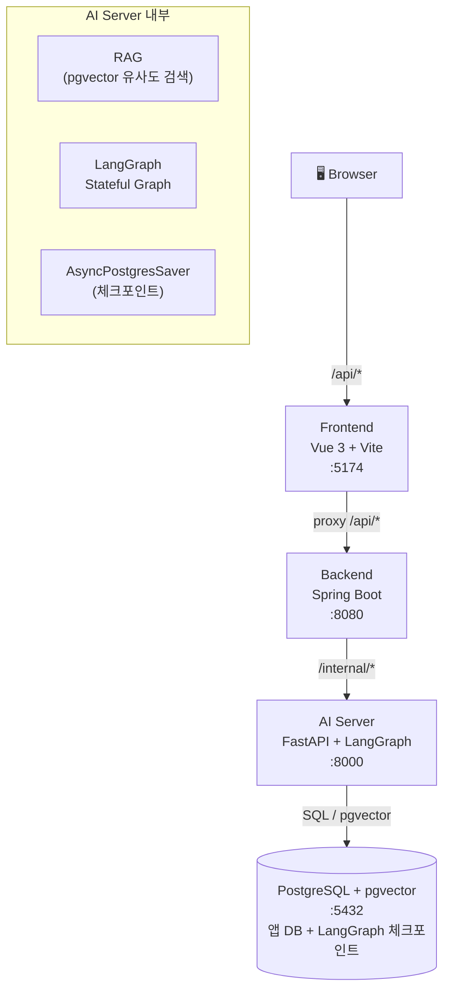
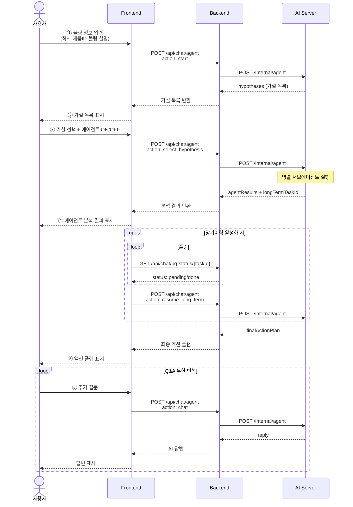
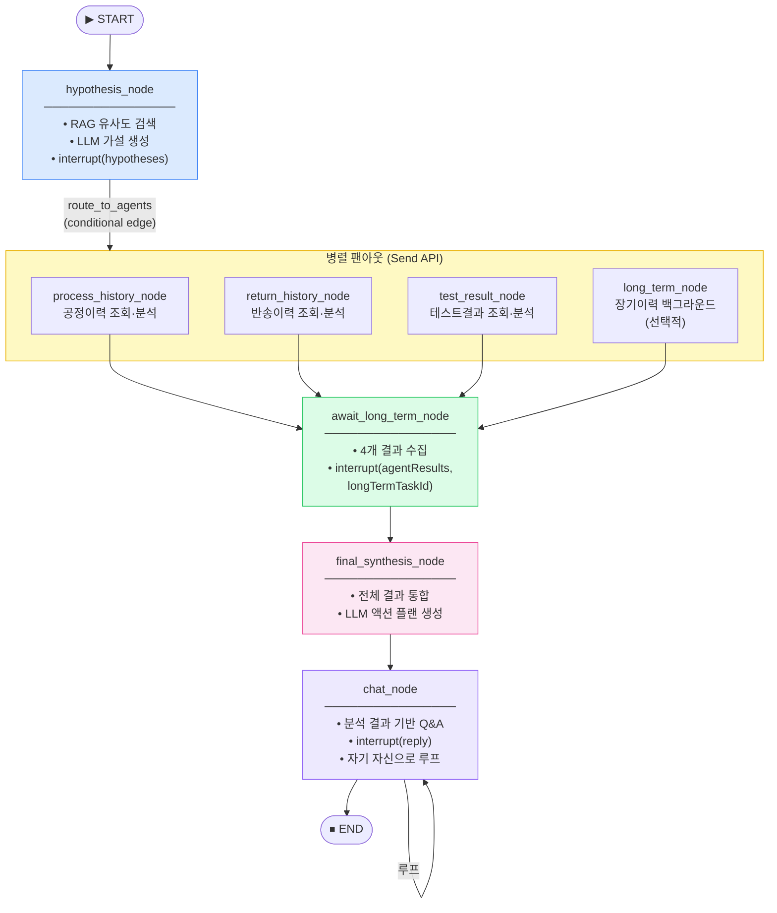
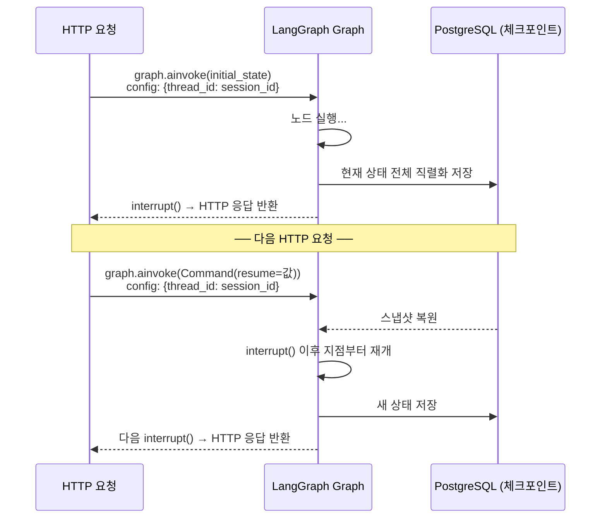
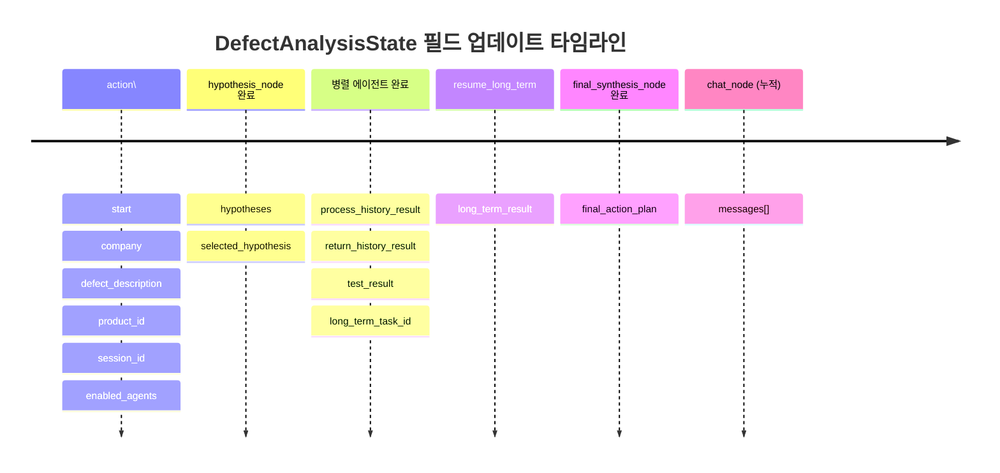
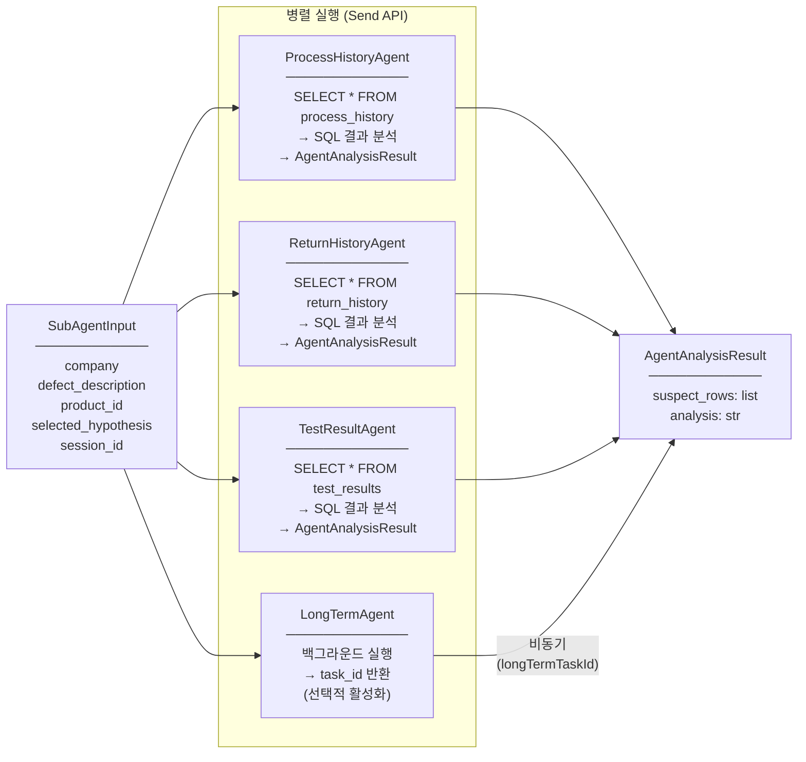
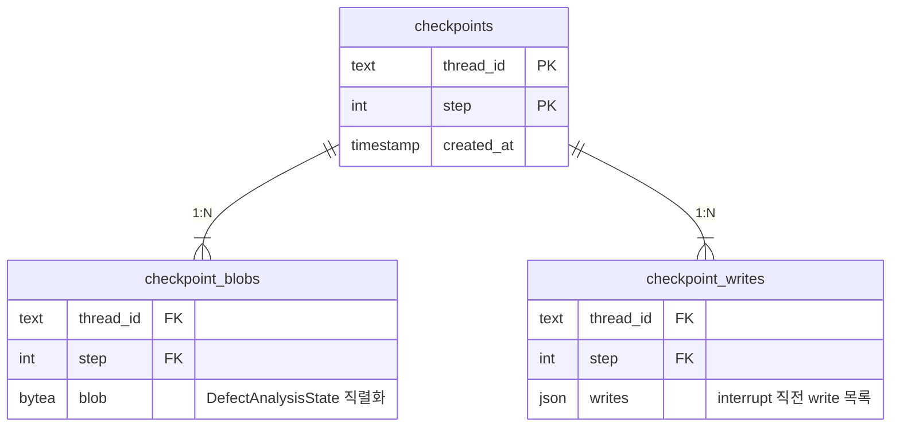
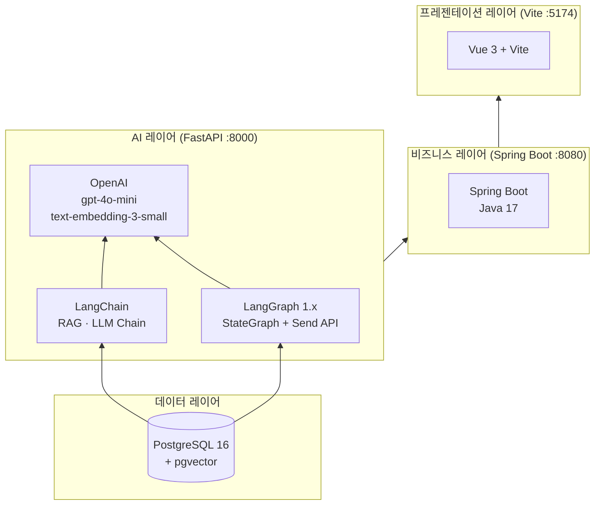

# Display Defect Chatbot — 발표 자료

---

## 1. 프로젝트 개요

**디스플레이 패널 픽셀 불량 AI 분석 챗봇**

| 항목 | 내용 |
|---|---|
| 목적 | 불량 설명 입력 → RAG 기반 가설 생성 → 병렬 DB 분석 → 액션 플랜 제시 |
| 특징 | LangGraph Stateful Graph (세션 복원 가능), 병렬 서브에이전트 |
| 기술 | Vue 3 · Spring Boot · FastAPI · LangGraph · PostgreSQL + pgvector |

---

## 2. 전체 아키텍처

---

## 3. 사용자 인터랙션 흐름

---

## 4. LangGraph 그래프 노드 구조

---

## 5. 핵심 메커니즘: interrupt / Command(resume)

> **핵심**: 각 HTTP 요청은 그래프를 처음부터 실행하지 않고 **마지막 interrupt 지점부터 재개**합니다.
> `thread_id = session_id`로 브라우저 탭마다 독립 세션이 유지됩니다.

---

## 6. State 생명주기

---

## 7. 병렬 서브에이전트 상세

---

## 8. 체크포인트 테이블 구조

---

## 9. 기술 스택 요약

---

## 10. 주요 설계 포인트

| 포인트 | 설명 |
|---|---|
| **Stateful Graph** | `interrupt()` + `Command(resume=)` + `AsyncPostgresSaver`로 서버 재시작 후에도 세션 복원 |
| **병렬 팬아웃** | LangGraph `Send API`로 3~4개 서브에이전트를 동시에 실행, `await_long_term_node`에서 자동 fan-in |
| **장기이력 비동기** | 오래 걸리는 장기이력 조회는 백그라운드 태스크로 분리, 프론트는 폴링으로 상태 확인 |
| **config 주입** | `RunnableConfig`로 `VectorStoreManager`를 노드에 주입, DB 커넥션을 그래프 외부에서 관리 |
| **add_messages reducer** | Q&A 이력은 `add_messages` reducer로 자동 누적, 별도 설계 없이 무한 대화 루프 구현 |
| **단일 DB** | 앱 데이터(불량이력 등)와 LangGraph 체크포인트를 같은 PostgreSQL 인스턴스에서 관리 |
