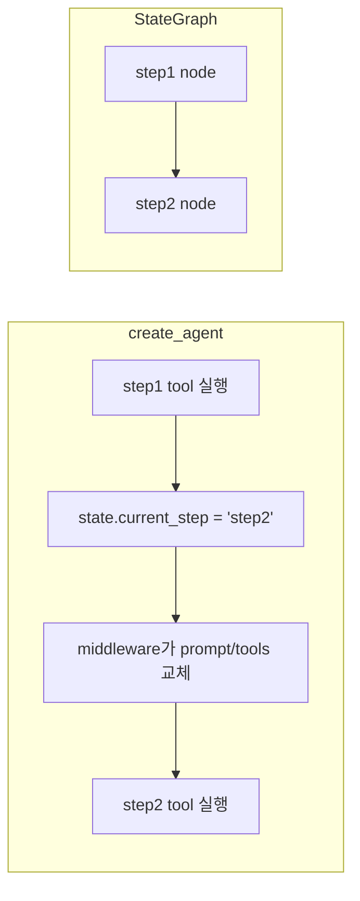
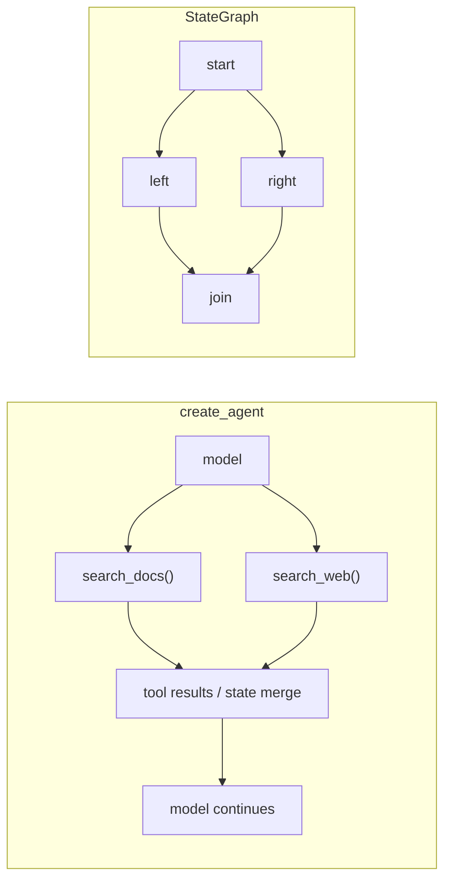
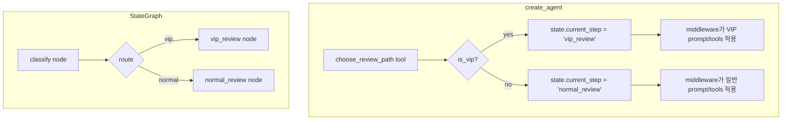
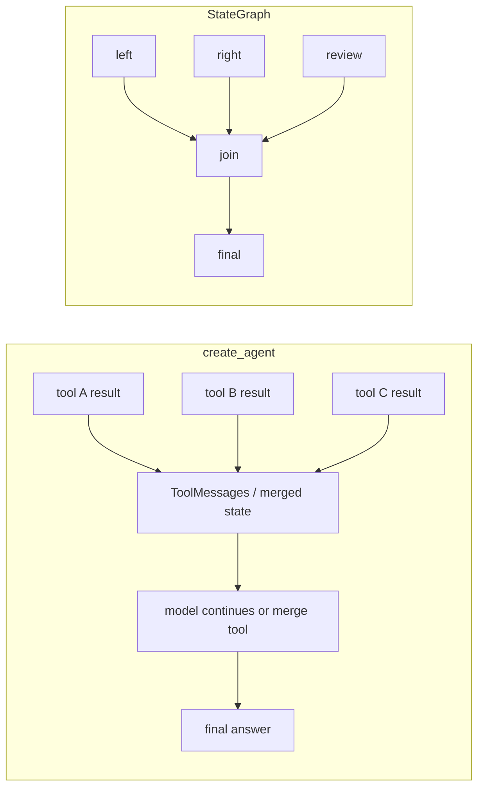

# `create_agent` vs `StateGraph` 정리
> 기준: **LangGraph v1 / LangChain v1**  
> 비교 축은 **`langchain.agents.create_agent` 방식 vs `StateGraph` 방식**입니다.

> 참고: 둘은 완전히 별개의 세계라기보다, **`create_agent`는 LangGraph 기반의 prebuilt agent**,  
> **`StateGraph`는 graph를 직접 설계하는 lower-level API**라고 이해하면 가장 정확합니다.

---

## 먼저 관점부터 맞추기

이 문서는 **“순차 / 병렬 / 분기 / 합류” 같은 workflow 개념을 코드에 어떻게 표현하느냐**를 기준으로 비교합니다.

- **`create_agent`의 기본 성격**은 모델이 상황에 따라 tool을 고르는 **동적 agent loop**
- **`StateGraph`의 기본 성격**은 state / node / edge를 개발자가 설계하는 **명시적 workflow graph**

즉, `create_agent` 쪽 예시는 주로 **workflow 같은 흐름을 agent 위에서 어떻게 흉내 내는가**를 보여주는 것이고,  
`StateGraph` 쪽 예시는 **그 흐름을 graph에 직접 어떻게 적는가**를 보여주는 것입니다.

---

## 한눈에 요약

| 항목 | `create_agent` | `StateGraph` |
|---|---|---|
| 중심 개념 | 모델이 tool을 고르는 **agent loop** | 상태와 흐름을 직접 설계하는 **workflow graph** |
| 순서 표현 | 보통 `current_step` 같은 **상태 전이**로 표현 | `node / edge`로 **명시적 연결** |
| 병렬 표현 | 모델이 한 턴에서 여러 tool call을 만들면 **runtime이 병렬 실행 가능**. 필요하면 tool 내부 병렬도 가능 | **fan-out / fan-in**을 graph에 직접 표현 |
| 분기 표현 | 기본적으로는 **모델의 tool 선택 자체가 동적 분기**. workflow형 분기는 상태값 + middleware로 표현 가능 | `conditional edges` 또는 `Command(goto=...)` |
| 합류 표현 | 여러 tool 결과가 **다음 model step**으로 돌아가거나, state를 읽는 다음 tool/model이 소비 | **join node**가 선행 branch 완료 후 실행 |
| 잘 맞는 경우 | 툴 기반 챗봇, 빠른 agent 구축, 모델 주도형 동적 실행 | 승인/검수/파이프라인 같은 명시적 업무 흐름 |

---

# 1) 순차 단계

## 핵심 차이
- **`create_agent`**: "A 다음 B"를 edge로 적기보다, 보통 `current_step = "step2"`처럼 **상태 변경**으로 표현
- **`StateGraph`**: `step1 -> step2`를 **그래프 연결선**으로 바로 표현

## 코드 감각
### `create_agent`
- step1 tool 실행
- state 업데이트
- middleware가 다음 단계 prompt/tools 교체

### `StateGraph`
- `add_edge("step1", "step2")`
- 흐름이 코드에 그대로 드러남

## 실무 판단
- **절차가 고정된 순차 흐름**이면 `StateGraph`가 더 직관적
- **에이전트가 중심이고 단계는 보조적**이면 `create_agent`도 가능

## Mermaid


## 한 줄 요약
> 순차 흐름은 **`create_agent`에서는 상태 전이**, **`StateGraph`에서는 edge 연결**로 보인다.

---

# 2) 병렬 단계

## 핵심 차이
- **`create_agent`**: 여러 tool을 등록해 두면, 모델이 한 턴에서 **여러 tool call을 동시에 생성**할 수 있고 runtime이 이를 병렬 실행할 수 있다
- **`StateGraph`**: `a -> b, c -> d`처럼 **병렬 분기와 합류를 graph 구조로 직접 표현**한다

즉 병렬의 차이는 **“병렬이 되느냐 / 안 되느냐”**가 아니라,

- `create_agent`는 **모델 주도형 parallel tool calls**
- `StateGraph`는 **개발자 주도형 explicit fan-out / fan-in**

이라는 점에 있다.

## 코드 감각
### `create_agent`
- `tools=[search_docs, search_web]`처럼 여러 tool을 등록
- 모델이 요청을 보고 독립 작업이라고 판단하면
  - `search_docs(...)`
  - `search_web(...)`
  를 **같은 턴에서 함께 호출**
- runtime이 이를 병렬 실행
- 병렬 branch 구조는 코드에 직접 드러나지 않는 편

### `StateGraph`
- `start -> left`
- `start -> right`
- `left -> join`
- `right -> join`

처럼 병렬 branch와 join을 graph에 직접 적는다.

## 실무 판단
- **병렬 tool 호출 자체**는 `create_agent`로도 충분히 가능
- 하지만 **branch 수, join 시점, state merge 방식**을 코드에 명시적으로 드러내고 싶다면 `StateGraph`가 더 적합
- 필요하다면 `create_agent`에서도 **tool 내부에서 추가 병렬 처리**를 할 수 있지만, 그것이 유일한 병렬 방식은 아니다

## Mermaid


## 주의
> `create_agent`에서 병렬 tool calls가 **같은 state 필드**를 함께 갱신할 수 있다면,  
> reducer를 정의해 충돌을 어떻게 합칠지 미리 정하는 것이 좋다.

## 한 줄 요약
> 병렬은 **`create_agent`에서도 가능**하지만,  
> **`create_agent`는 모델이 여러 tool call을 만들 때 runtime이 병렬 실행하는 방식**이고,  
> **`StateGraph`는 병렬 branch를 graph에 직접 그리는 방식**이다.

---

# 3) 분기 단계

## 핵심 차이
- **`create_agent`**: 기본적으로는 **모델이 어떤 tool을 고르느냐 자체가 분기**다  
  다만 workflow처럼 단계가 분명한 business branching을 만들고 싶다면, 보통 `current_step`를 바꾸고 middleware가 그 상태에 맞춰 행동 모드를 바꾼다
- **`StateGraph`**: 분기를 **그래프 차원에서 직접 선언**한다  
  - `add_conditional_edges()`
  - `Command(goto=...)`

## 코드 감각
### `create_agent`
- agent의 기본 분기: 모델이 상황에 따라 다른 tool 선택
- workflow형 분기:
  - `choose_review_path()`가 `vip_review` 또는 `normal_review`로 state 변경
  - 다음 행동은 middleware가 결정

### `StateGraph`
- 라우팅 함수를 따로 두고 `add_conditional_edges()` 사용
- 또는 node 안에서 `Command(update=..., goto=...)`

## 실무 판단
- **비즈니스 분기 자체가 핵심**이면 `StateGraph`가 훨씬 명확
- **모델이 상황을 보고 적절한 tool을 고르게 하는 동적 분기**는 `create_agent`가 자연스럽다
- **정해진 step machine 형태의 분기**를 agent 위에 올리고 싶으면 `current_step + middleware` 패턴이 유용하다

## Mermaid


## 한 줄 요약
> 분기는 **`create_agent`에서는 모델 선택 또는 step 상태 변경**,  
> **`StateGraph`에서는 conditional edge / `Command(goto)`**로 표현된다.

---

# 4) 합류 단계

## 핵심 차이
- **`create_agent`**: 앞선 여러 tool 결과가 agent loop를 통해 **다음 model step**으로 돌아간다.  
  필요하면 state에 쌓아두고 다음 tool/model이 읽어 합칠 수도 있다.
- **`StateGraph`**: **join node**가 선행 branch 완료 후 실행된다

즉, `create_agent` 쪽 합류는 종종 **암묵적 합류**다.

- tool A 결과
- tool B 결과
- tool C 결과

가 모두 model에 돌아오고, 모델이 이를 바탕으로 다음 응답을 생성한다.  
반면 `StateGraph`는 **join이 코드 구조로 명시**된다.

## 코드 감각
### `create_agent`
- 여러 tool 결과가 `ToolMessage`들로 model에 돌아감
- 또는 `left_result`, `right_result`, `review_result` 같은 state를 다음 tool/model이 읽어 최종 정리
- 별도 join node가 없는 경우가 많음

### `StateGraph`
- `left -> join`
- `right -> join`
- branch 길이가 다르면 `defer=True`로 더 안정적으로 합류 시점 제어 가능

## 실무 판단
- **단순히 여러 결과를 모아서 모델이 답변하게 하면 되는 경우**는 `create_agent`도 충분
- **join timing, branch 완료 보장, 구조적 합류**가 중요하면 `StateGraph`가 훨씬 유리

## Mermaid


## 한 줄 요약
> 합류는 **`create_agent`에서는 다음 model step으로 결과가 돌아가는 암묵적 취합**,  
> **`StateGraph`에서는 join node 기반의 명시적 동기화**로 이해하면 된다.

---

# 분기/병렬/합류에서 자주 비교하는 선택지

## A. 분기: `add_conditional_edges` vs `Command`
| 방식 | 장점 | 단점 | 추천 상황 |
|---|---|---|---|
| `add_conditional_edges` | 라우팅이 edge에 드러나서 읽기 좋음 | 업데이트와 분기를 따로 관리해야 함 | graph 구조를 명확하게 보여주고 싶을 때 |
| `Command(update=..., goto=...)` | 업데이트 + 이동을 한 함수에서 처리 | node 책임이 커질 수 있음 | 계산 결과 저장 후 바로 다음 node를 결정할 때 |

## B. 병렬 fan-out: 고정 edge vs `Send`
| 방식 | 장점 | 단점 | 추천 상황 |
|---|---|---|---|
| 고정 edge | 단순하고 시각화 쉬움 | branch 수가 런타임에 바뀌면 불편 | 병렬 대상 수가 고정일 때 |
| `Send` | 동적 fan-out 가능 | reducer/state 설계가 더 중요 | map-reduce, N개 동적 작업 |

## C. 합류: 기본 fan-in vs `defer=True`
| 방식 | 장점 | 단점 | 추천 상황 |
|---|---|---|---|
| 기본 fan-in | 가장 단순 | branch 길이가 다르면 시점이 어긋날 수 있음 | 병렬 branch 깊이가 비슷할 때 |
| `defer=True` | 모든 pending task 종료 후 합류 보장 | 실행이 뒤로 밀릴 수 있음 | branch 길이가 다를 때 |

## D. 순차: `add_edge` vs `add_sequence`
| 방식 | 장점 | 단점 | 추천 상황 |
|---|---|---|---|
| `add_edge` 연쇄 | 세밀한 제어 가능 | 장황할 수 있음 | 중간에 분기/합류 가능성이 있을 때 |
| `add_sequence` | 짧고 읽기 쉬움 | 완전 직선형이 아니면 다시 풀어써야 함 | 단순 직렬 파이프라인 |

---

# 최종 정리

## `create_agent`가 더 잘 맞는 경우
- 툴 호출 중심의 **챗봇/에이전트**
- 빨리 프로토타입을 만들고 싶을 때
- 흐름보다 **모델의 동적 판단**이 더 중요할 때
- 병렬도 **모델이 여러 tool call을 만들면 자연스럽게 처리**되면 충분할 때

## `StateGraph`가 더 잘 맞는 경우
- 승인, 검수, ETL, 멀티스텝 실행처럼 **업무 흐름 자체가 중요**할 때
- 순차/병렬/분기/합류를 **코드 구조로 명시**해야 할 때
- join timing, dynamic routing, fan-out/fan-in, reducer 설계가 중요할 때

---

# 한 줄 결론

> **빠르게 agent를 만들려면 `create_agent`**,  
> **흐름 자체를 설계해야 하면 `StateGraph`**가 더 적합하다.

---

# 추가: 각 4단계를 `create_agent`로 구현했을 때와 `StateGraph`로 구현했을 때의 코드 차이

아래는 **같은 개념을 구현하더라도 코드가 어떻게 달라지는지**를 단계별로 비교한 것이다.  
핵심은 다음 한 줄로 먼저 정리할 수 있다.

> **`create_agent`는 상태 전이와 agent loop 중심**,  
> **`StateGraph`는 node/edge 중심**으로 코드가 달라진다.

---

## 5-1) 순차 단계 코드 차이

### `create_agent`
`create_agent`에서는 순서를 edge로 적기보다, **현재 단계 상태를 바꾸는 방식**으로 표현하는 경우가 많다.

```python
from langchain.agents import create_agent, AgentState
from langchain.agents.middleware import wrap_model_call, ModelRequest, ModelResponse
from langchain.tools import tool, ToolRuntime
from langgraph.types import Command

class FlowState(AgentState):
    current_step: str

@tool
def step1_tool(runtime: ToolRuntime[None, FlowState]) -> Command:
    return Command(update={"current_step": "step2"})

@tool
def step2_tool(runtime: ToolRuntime[None, FlowState]) -> str:
    return "step2 done"

STEP_CONFIG = {
    "step1": {
        "prompt": "지금은 step1 단계다. step1_tool만 사용해라.",
        "tools": [step1_tool],
    },
    "step2": {
        "prompt": "지금은 step2 단계다. step2_tool만 사용해라.",
        "tools": [step2_tool],
    },
}

@wrap_model_call
def apply_step_config(request: ModelRequest, handler) -> ModelResponse:
    step = request.state.get("current_step", "step1")
    cfg = STEP_CONFIG[step]
    request = request.override(
        system_prompt=cfg["prompt"],
        tools=cfg["tools"],
    )
    return handler(request)

agent = create_agent(
    model="your-model",
    tools=[step1_tool, step2_tool],
    state_schema=FlowState,
    middleware=[apply_step_config],
)
```

### `StateGraph`
`StateGraph`에서는 **순서 자체를 edge로 직접 연결**한다.

```python
from typing_extensions import TypedDict
from langgraph.graph import StateGraph, START, END

class State(TypedDict):
    text: str

def step1(state: State):
    return {"text": state["text"] + " -> step1"}

def step2(state: State):
    return {"text": state["text"] + " -> step2"}

builder = StateGraph(State)
builder.add_node("step1", step1)
builder.add_node("step2", step2)
builder.add_edge(START, "step1")
builder.add_edge("step1", "step2")
builder.add_edge("step2", END)

graph = builder.compile()
```

### 코드 차이 포인트
| 비교 항목 | `create_agent` | `StateGraph` |
|---|---|---|
| 순서 표현 방식 | `current_step = "step2"` 같은 **상태 전이** | `add_edge("step1", "step2")` 같은 **명시적 연결** |
| 제어 위치 | tool + middleware | graph builder |
| 코드에서 흐름 가시성 | 낮음 | 높음 |

---

## 5-2) 병렬 단계 코드 차이

### `create_agent`
`create_agent`에서는 **여러 tool을 등록해두고**, 모델이 독립 작업이라고 판단하면 **한 턴에서 여러 tool call을 생성**할 수 있다.  
이 병렬성은 code graph에 직접 드러나기보다 **agent runtime 동작**으로 나타난다.

```python
import operator
from typing import Annotated
from langchain.agents import create_agent, AgentState
from langchain.tools import tool, ToolRuntime
from langgraph.types import Command

class FlowState(AgentState):
    findings: Annotated[list[str], operator.add]

@tool
def search_docs(query: str, runtime: ToolRuntime[None, FlowState]) -> Command:
    return Command(update={"findings": [f"docs:{query}"]})

@tool
def search_web(query: str, runtime: ToolRuntime[None, FlowState]) -> Command:
    return Command(update={"findings": [f"web:{query}"]})

agent = create_agent(
    model="your-model",
    tools=[search_docs, search_web],
    state_schema=FlowState,
)

result = agent.invoke({
    "messages": [
        {"role": "user", "content": "사내 문서와 웹을 둘 다 찾아 핵심만 합쳐줘"}
    ]
})
```

위 예시에서 병렬의 핵심은 이렇다.

- `search_docs`, `search_web`를 **여러 개 등록**
- 모델이 **둘 다 필요하다**고 판단하면
- 한 턴에서 **여러 tool call**을 만들 수 있음
- runtime이 이를 병렬 실행할 수 있음
- `findings`는 여러 tool이 동시에 갱신할 수 있으므로 reducer(`operator.add`)를 둠

즉, 병렬 branch는 code에 직접 그려지지 않는다.

### `StateGraph`
`StateGraph`에서는 **병렬 branch를 node/edge로 직접 드러낸다**.

```python
import operator
from typing import Annotated
from typing_extensions import TypedDict
from langgraph.graph import StateGraph, START, END

class State(TypedDict):
    aggregate: Annotated[list[str], operator.add]

def start(state: State):
    return {"aggregate": ["start"]}

def left(state: State):
    return {"aggregate": ["left"]}

def right(state: State):
    return {"aggregate": ["right"]}

def join(state: State):
    return {"aggregate": ["join"]}

builder = StateGraph(State)
builder.add_node("start", start)
builder.add_node("left", left)
builder.add_node("right", right)
builder.add_node("join", join)

builder.add_edge(START, "start")
builder.add_edge("start", "left")
builder.add_edge("start", "right")
builder.add_edge("left", "join")
builder.add_edge("right", "join")
builder.add_edge("join", END)

graph = builder.compile()
```

### 코드 차이 포인트
| 비교 항목 | `create_agent` | `StateGraph` |
|---|---|---|
| 병렬 표현 방식 | 모델이 여러 tool call을 만들면 runtime이 병렬 실행 | 여러 node를 병렬 edge로 연결 |
| 병렬 구조의 가시성 | 낮음 | 매우 높음 |
| 상태 충돌 처리 | 같은 필드를 병렬 갱신하면 reducer 고려 | reducer/state merge를 graph 설계에 포함 |
| 합류 표현 | 다음 model step 또는 다음 tool이 결과 소비 | `join` node로 명시 |

---

## 5-3) 분기 단계 코드 차이

### `create_agent`
`create_agent`의 기본 분기는 **모델의 tool 선택**이다.  
다만 workflow처럼 고정된 business branching을 만들고 싶으면, 보통 **상태값 변경**으로 구현한다.

```python
from langchain.tools import tool, ToolRuntime
from langgraph.types import Command

class FlowState(AgentState):
    current_step: str
    review_result: str

@tool
def choose_review_path(is_vip: bool, runtime: ToolRuntime[None, FlowState]) -> Command:
    next_step = "vip_review" if is_vip else "normal_review"
    return Command(update={"current_step": next_step})

@tool
def vip_review(runtime: ToolRuntime[None, FlowState]) -> Command:
    return Command(
        update={
            "review_result": "VIP_REVIEW_OK",
            "current_step": "join_stage",
        }
    )

@tool
def normal_review(runtime: ToolRuntime[None, FlowState]) -> Command:
    return Command(
        update={
            "review_result": "NORMAL_REVIEW_OK",
            "current_step": "join_stage",
        }
    )
```

그리고 middleware가 `current_step`를 읽어서 그 단계에 맞는 prompt/tools를 바꾼다.

```python
STEP_CONFIG = {
    "review_branch": {
        "prompt": "지금은 분기 단계다. choose_review_path만 사용해라.",
        "tools": [choose_review_path],
    },
    "vip_review": {
        "prompt": "VIP 검토 단계다. vip_review만 사용해라.",
        "tools": [vip_review],
    },
    "normal_review": {
        "prompt": "일반 검토 단계다. normal_review만 사용해라.",
        "tools": [normal_review],
    },
}
```

### `StateGraph` - `add_conditional_edges`
`StateGraph`에서는 라우팅을 **graph 레벨에서 직접 선언**할 수 있다.

```python
from typing import Literal
from typing_extensions import TypedDict
from langgraph.graph import StateGraph, START, END

class State(TypedDict):
    amount: int
    route: str

def classify(state: State):
    route = "manager_review" if state["amount"] >= 100000 else "auto_approve"
    return {"route": route}

def route_fn(state: State) -> Literal["manager_review", "auto_approve"]:
    return state["route"]

def manager_review(state: State):
    return {"route": "manager_review_done"}

def auto_approve(state: State):
    return {"route": "auto_approve_done"}

builder = StateGraph(State)
builder.add_node("classify", classify)
builder.add_node("manager_review", manager_review)
builder.add_node("auto_approve", auto_approve)

builder.add_edge(START, "classify")
builder.add_conditional_edges("classify", route_fn)
builder.add_edge("manager_review", END)
builder.add_edge("auto_approve", END)

graph = builder.compile()
```

### `StateGraph` - `Command(goto=...)`
분기와 상태 업데이트를 한 node에서 같이 처리할 수도 있다.

```python
from typing import Literal
from typing_extensions import TypedDict
from langgraph.graph import StateGraph, START, END
from langgraph.types import Command

class State(TypedDict):
    amount: int
    route: str

def classify(state: State) -> Command[Literal["manager_review", "auto_approve"]]:
    goto = "manager_review" if state["amount"] >= 100000 else "auto_approve"
    return Command(
        update={"route": goto},
        goto=goto,
    )

def manager_review(state: State):
    return {"route": "manager_review_done"}

def auto_approve(state: State):
    return {"route": "auto_approve_done"}

builder = StateGraph(State)
builder.add_node("classify", classify)
builder.add_node("manager_review", manager_review)
builder.add_node("auto_approve", auto_approve)

builder.add_edge(START, "classify")
builder.add_edge("manager_review", END)
builder.add_edge("auto_approve", END)

graph = builder.compile()
```

### 코드 차이 포인트
| 비교 항목 | `create_agent` | `StateGraph` |
|---|---|---|
| 기본 분기 성격 | 모델이 어떤 tool을 고를지 동적으로 결정 | 개발자가 routing 규칙을 graph에 선언 |
| workflow형 분기 기준 저장 | `current_step` 변경 | state 값 저장 후 edge routing 또는 `goto` |
| 분기 위치 | tool 내부 + middleware 해석 | graph routing 함수 또는 `Command(goto)` |
| 흐름 가시성 | 간접적 | 직접적 |

---

## 5-4) 합류 단계 코드 차이

### `create_agent`
`create_agent`에는 보통 **명시적인 join node가 없다**.  
합류는 크게 두 방식으로 나타난다.

#### 방식 1) 암묵적 합류: 여러 tool 결과가 model로 돌아감
```python
from langchain.agents import create_agent

agent = create_agent(
    model="your-model",
    tools=[search_docs, search_web],
)

result = agent.invoke({
    "messages": [
        {"role": "user", "content": "사내 문서와 웹 결과를 둘 다 확인하고 하나로 정리해줘"}
    ]
})
```

이 경우 join은 코드에 `join`이라는 node로 드러나지 않는다.  
대신 여러 tool 결과가 model에 돌아가고, 모델이 그것을 바탕으로 최종 응답을 합성한다.

#### 방식 2) state 기반 합류: 다음 tool이 state를 읽음
```python
from langchain.tools import tool, ToolRuntime

@tool
def merge_findings(runtime: ToolRuntime[None, FlowState]) -> str:
    return "\n".join(runtime.state["findings"])
```

즉 `create_agent`의 합류는 보통 **다음 model step** 또는 **다음 tool이 state를 읽는 단계**로 표현된다.

### `StateGraph`
`StateGraph`에서는 **join node가 선행 branch들의 완료 후 실행**된다.

```python
import operator
from typing import Annotated
from typing_extensions import TypedDict
from langgraph.graph import StateGraph, START, END

class State(TypedDict):
    aggregate: Annotated[list[str], operator.add]

def left(state: State):
    return {"aggregate": ["left_done"]}

def right(state: State):
    return {"aggregate": ["right_done"]}

def review(state: State):
    return {"aggregate": ["review_done"]}

def join(state: State):
    joined = ", ".join(state["aggregate"])
    return {"aggregate": [f"joined: {joined}"]}

builder = StateGraph(State)
builder.add_node("left", left)
builder.add_node("right", right)
builder.add_node("review", review)
builder.add_node("join", join)

builder.add_edge(START, "left")
builder.add_edge(START, "right")
builder.add_edge(START, "review")
builder.add_edge("left", "join")
builder.add_edge("right", "join")
builder.add_edge("review", "join")
builder.add_edge("join", END)

graph = builder.compile()
```

### branch 길이가 다를 때
branch 깊이가 다르면 `join`을 늦게 실행하도록 둘 수도 있다.

```python
builder.add_node("join", join, defer=True)
```

### 코드 차이 포인트
| 비교 항목 | `create_agent` | `StateGraph` |
|---|---|---|
| 합류 방식 | 여러 tool 결과가 다음 model step 또는 merge tool로 전달 | join node가 branch 완료 후 실행 |
| join의 표현 | 암묵적 | 명시적 |
| 동기화 의미 | runtime / model continuation | graph-level synchronization |
| branch 길이 차이 대응 | 직접 설계 필요 | `defer=True` 같은 graph 제어 가능 |

---

# 6) 4단계 전체를 놓고 본 코드 차이 요약

| 단계 | `create_agent`에서 코드가 보이는 방식 | `StateGraph`에서 코드가 보이는 방식 |
|---|---|---|
| 순차 | 상태 변경 + middleware | `add_edge`, `add_sequence` |
| 병렬 | 모델이 여러 tool call을 만들면 runtime이 병렬 실행 | 병렬 node + fan-out/fan-in |
| 분기 | 모델의 tool 선택 또는 `current_step` 변경 | `add_conditional_edges` 또는 `Command(goto)` |
| 합류 | tool results / merged state가 다음 model step 또는 다음 tool로 전달 | join node, 필요 시 `defer=True` |

---

# 7) 최종 한 줄 비교

> **`create_agent`는 "모델이 tool을 고르고, 그 결과를 다시 받아 다음 행동을 정하는 코드"가 되고,**  
> **`StateGraph`는 "흐름 자체를 graph로 그리는 코드"가 된다.**