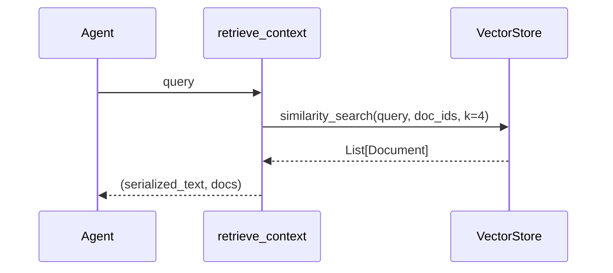
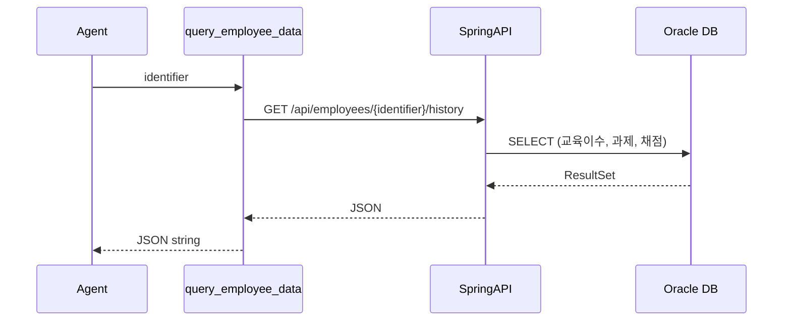
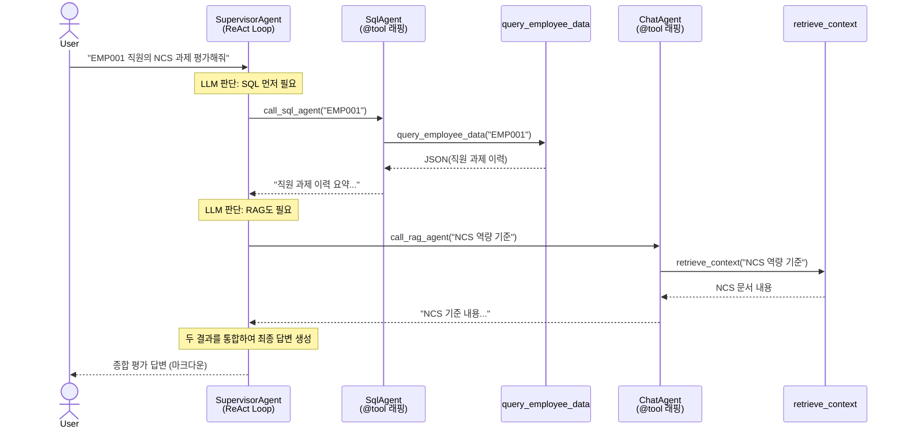
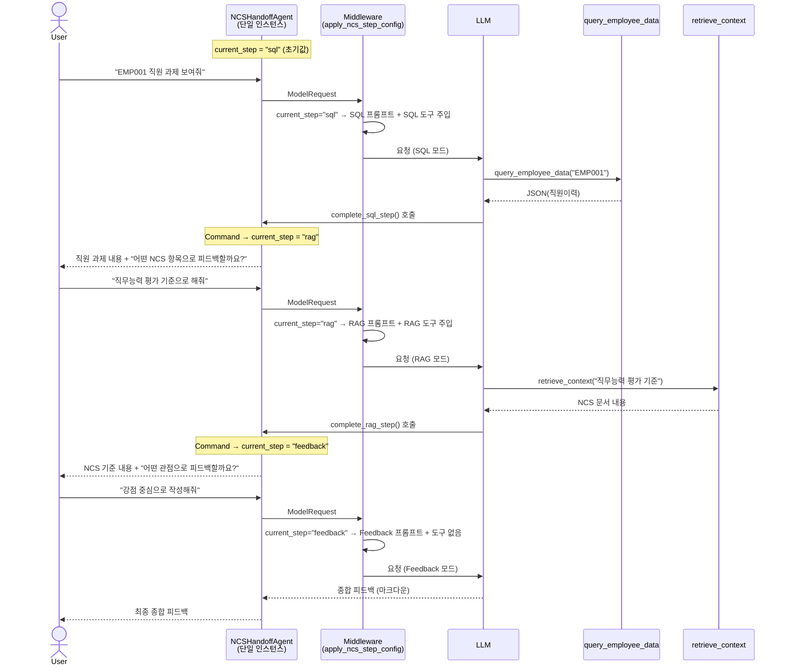
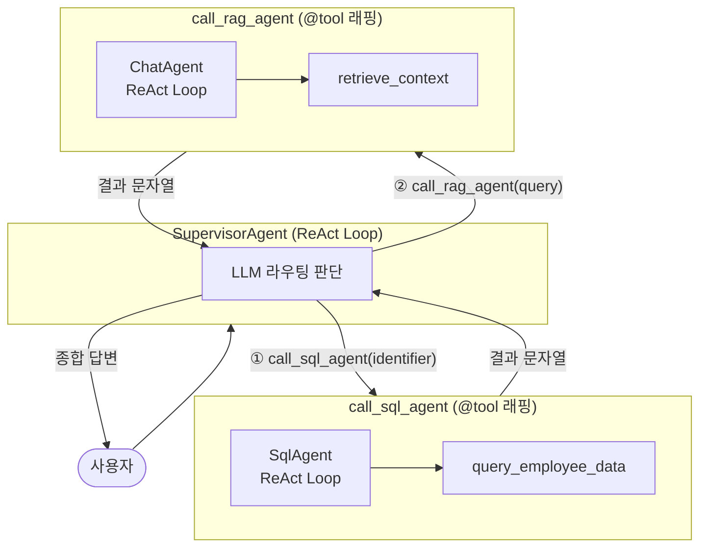
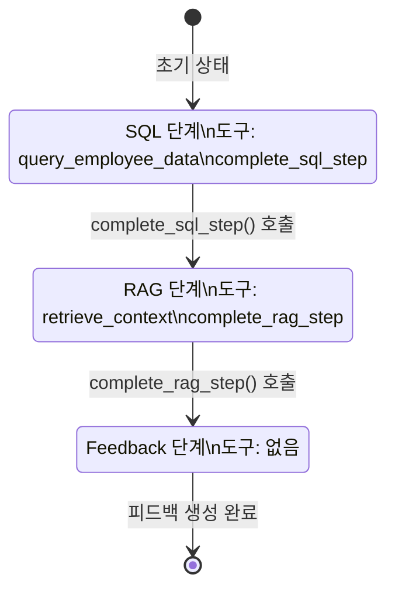

# NCS RAG Chatbot — 멀티에이전트 아키텍처 설명

> 이 문서는 NCS RAG Chatbot의 멀티에이전트 구현인 **Subagents** 과 **Handoffs** 방식을 비교 설명한다.

---

## 1. 시나리오 개요

NCS(국가직무능력표준) 기반 직원 교육 관리 챗봇이다. HR 담당자 또는 관리자가 특정 직원의 교육 이수 내역·과제 제출 결과를 확인하고, NCS 기준 문서와 대조하여 **맞춤형 피드백**을 받는 것이 핵심 시나리오다.

### 사용 흐름

```
1. 사용자: "EMP001 직원 과제 보여줘"
   → SQL 조회: 직원이 제출한 과제 내용과 함께 직원 이력을 반환

2. 사용자: "REST API 관련해서 채점하기 위해 자료를 가져와줘."
   → RAG 검색: 관련 NCS 문서 검색 후 기준 제시

3. 사용자: "강점 중심으로 피드백 작성해줘"
   → 최종 피드백: 직원 이력 + NCS 기준을 종합한 마크다운 피드백 생성
```

---

## 2. 도구(Tool) 명세

### 2-1. `retrieve_context` — NCS 문서 검색 도구

<br>

**입력(Input)**

```python
query: str          # 검색 키워드 / 자연어 질문
```

**출력(Output)**

```
# 정상
"[doc_id: D001, page: 3]\n... NCS 기준 내용 ..."
→ (serialized_text, List[Document])

# 검색 결과 없음
"관련 문서를 찾을 수 없습니다.", []
```

**동작 방식**

1. `VectorStoreManager.similarity_search_by_doc_ids(query, doc_ids, k=4)`로 벡터 유사도 검색을 수행한다.
2. 결과를 `[doc_id, page]` 메타데이터와 함께 직렬화하여 반환한다.



---

### 2-2. `query_employee_data` — 직원 이력 조회 도구

<br>

**입력(Input)**

```python
identifier: str  # 사번(예: EMP001) 또는 직원 이름(예: 홍길동)
```

**출력(Output)**

```json
{
  "employeeId": "EMP001",
  "name": "홍길동",
  "educationHistory": [...],
  "assignments": [...],
  "gradingResults": [...]
}
```

**동작 방식**

1. Spring Boot API를 비동기 호출한다.
2. 응답을 `json.dumps(ensure_ascii=False, indent=2)`로 직렬화하여 반환한다.
3. 예외 발생 시 오류 메시지를 문자열로 반환한다.



---

## 3. 에이전트 구조

### 3-1. SQL Agent

| 항목 | 내용 |
|------|------|
| 역할 | 직원 이력 조회 전담 |
| 도구 | `[query_employee_data]` |

**시스템 프롬프트 요약**

```
- 직원 NCS 교육 이수 내역 조회 전문가
- 사번(EMP001) 또는 이름으로 query_employee_data 호출
- 결과를 한국어로 정리하여 답변
```

SQL Agent는 LangGraph의 `create_agent()`로 생성된 ReAct 에이전트다. `query_employee_data` 하나를 도구로 가지며, 사용자 메시지에서 직원 식별자를 추출하여 HTTP 조회를 수행한다.

---

### 3-2. RAG Agent (ChatAgent)

| 항목 | 내용 |
|------|------|
| 역할 | NCS 문서 벡터 검색 전담 |
| 도구 | `[retrieve_context]` |

RAG Agent는 `retrieve_context` 도구를 사용하여 VectorStore에서 NCS 기준 문서를 검색하고, 결과를 정리해 반환한다. `config`를 통해 `doc_ids` 필터를 받아 특정 NCS 문서 범위 내에서만 검색한다.

---

## 4. Subagents vs Handoffs 비교: 멀티에이전트 아키텍처

### 한눈에 보기

| 구분 | Subagents | Handoffs |
|------|----------------|---------------|
| 핵심 | **사용자 요청에 따라 Agent가 알아서 필요한 도구를 선택** | **상태에 따라 맞춰서 Agent 전환** |
| 패턴 | **Supervisor가 서브에이전트를 `@tool`로 래핑** | **단일 에이전트 + 상태(`current_step`)로 역할 전환** |
| 에이전트 수 | 3개 (Supervisor + SQL + RAG) | 1개 (NCSHandoffAgent) |
| 라우팅 | LLM이 판단하여 도구 선택 (자유도 높음) | 단계 순서가 코드로 고정 (`sql → rag → feedback`) |
| 컨텍스트 격리 | 서브에이전트는 독립된 메시지 컨텍스트 | 단일 메시지 히스토리 공유 |
| 사용자 상호작용 | Supervisor가 단일 응답 생성 | 각 단계에서 사용자 입력 대기 (multi-turn) |
| 상태 스키마 | `AgentState` (기본) | `NCSAgentState` (`current_step` 필드 추가) |
| 미들웨어 | 없음 | `wrap_model_call` — 매 LLM 호출 전 프롬프트/도구 교체 |
| 적합한 상황 | 질문 유형이 다양하고 라우팅 판단이 필요할 때 | 단계별 정보 수집이 필수인 워크플로우 |

---

## 5. Subagents 방식 상세

### 개념

> "Supervisor가 서브에이전트를 **도구**처럼 호출한다."

LangChain 공식 [Subagents 패턴](https://docs.langchain.com/oss/python/langchain/multi-agent/subagents.md)을 따른다. SQL Agent와 RAG Agent는 각각 독립된 LangGraph 에이전트로 생성된 뒤, `@tool` 데코레이터로 래핑되어 Supervisor의 도구 목록에 등록된다.

Supervisor는 사용자 질문을 받아 LLM이 어떤 도구를 호출할지 결정한다. 서브에이전트는 도구 함수 내부에서 비동기로 실행되며, 결과는 Supervisor의 메시지 컨텍스트로 돌아온다.

### 핵심 코드 구조

```python
# 서브에이전트를 @tool로 래핑
@tool
async def call_sql_agent(identifier: str, config: RunnableConfig) -> str:
    result = await _sql.run(identifier, config=config)
    return result.content if result else "SQL 에이전트 응답 없음"

@tool
async def call_rag_agent(query: str, config: RunnableConfig) -> str:
    result = await _rag.run(query, config=config)
    return result.content if result else "RAG 에이전트 응답 없음"

# Supervisor에게 래핑된 도구 등록
supervisor.agent = create_agent(
    model,
    tools=[call_rag_agent, call_sql_agent],
    system_prompt=SUPERVISOR_SYSTEM_PROMPT,
    checkpointer=InMemorySaver(),
)
```

### 라우팅 규칙 (시스템 프롬프트)

```
1. 사번/이름이 포함 → call_sql_agent 먼저
2. NCS 기준/직무능력 내용 필요 → call_rag_agent
3. 둘 다 필요 → call_sql_agent 먼저 실행 → 결과 포함하여 call_rag_agent
4. 두 결과를 통합하여 최종 답변 생성
```

라우팅 결정은 LLM이 시스템 프롬프트 지침을 따라 수행한다. 따라서 질문이 모호하면 LLM이 잘못된 도구를 선택하거나 순서를 바꿀 수 있다.

### 동작 흐름



### 특징 정리

- **자율 라우팅**: LLM이 질문 성격에 따라 도구 호출 순서를 결정한다.
- **컨텍스트 격리**: 서브에이전트는 독립된 메시지 히스토리를 가진다. Supervisor는 결과(문자열)만 받는다.
- **단일 응답**: 사용자는 질문 1번에 완성된 답변 1개를 받는다.
- **유연성**: 질문 유형이 다양하거나 라우팅 조건이 복잡할 때 유리하다.

---

## 6. Handoffs 방식 상세

### 개념

> "단일 에이전트가 **상태(current_step)**에 따라 역할을 전환한다."

LangChain 공식 [Handoffs 패턴](https://docs.langchain.com/oss/python/langchain/multi-agent/handoffs.md)의 **Single Agent with Middleware** 방식을 적용한다. SQL/RAG Agent를 별도로 생성하지 않고, 하나의 `create_agent()` 인스턴스가 `current_step` 상태값에 따라 다른 시스템 프롬프트와 도구 세트로 동작한다.

단계 전환은 `complete_sql_step` / `complete_rag_step` 도구가 `Command` 객체를 반환하여 상태를 업데이트함으로써 이루어진다. 이 구조는 **3단계 순차 워크플로우**가 보장되며, 각 단계에서 사용자와 상호작용한다.

### 상태 스키마

```python
NCSStep = Literal["sql", "rag", "feedback"]

class NCSAgentState(AgentState):
    current_step: NotRequired[NCSStep]  # 기본값: "sql"
```

`current_step`이 `"sql"`이면 직원 조회 모드, `"rag"`이면 NCS 검색 모드, `"feedback"`이면 최종 피드백 생성 모드로 동작한다.

### 단계별 설정

| 단계 | 시스템 프롬프트 | 사용 도구 |
|------|----------------|-----------|
| `sql` | 직원 이력 조회 전문가, 결과 보여주고 NCS 항목 질문 | `query_employee_data`, `complete_sql_step` |
| `rag` | NCS 문서 검색 전문가, 결과 보여주고 피드백 방향 질문 | `retrieve_context`, `complete_rag_step` |
| `feedback` | NCS 피드백 전문가, 종합 피드백 작성 | (도구 없음, 순수 생성) |

### 미들웨어 메커니즘

```python
@wrap_model_call
async def apply_ncs_step_config(request: ModelRequest, handler) -> ModelResponse:
    # 매 LLM 호출 전 실행
    current_step = request.state.get("current_step", "sql")
    config = step_config[current_step]
    request = request.override(
        system_prompt=config["prompt"],
        tools=config["tools"],
    )
    return await handler(request)
```

미들웨어는 LLM에 요청이 전달되기 직전에 `current_step`을 읽어 **시스템 프롬프트와 도구 목록을 동적으로 교체**한다. LLM은 항상 현재 단계에 맞는 컨텍스트만 받는다.

### 단계 전환 메커니즘

```python
@tool
def complete_sql_step(runtime: ToolRuntime[None, NCSAgentState]) -> Command:
    return Command(
        update={
            "messages": [ToolMessage(content="...", tool_call_id=runtime.tool_call_id)],
            "current_step": "rag",   # ← 상태 업데이트
        }
    )
```

에이전트가 `complete_sql_step` 도구를 호출하면 `Command`가 LangGraph 상태를 직접 업데이트한다. 다음 LLM 호출 시 미들웨어가 새로운 `current_step`을 읽어 다른 프롬프트와 도구로 전환한다.

### 동작 흐름



### 특징 정리

- **순서 보장**: `sql → rag → feedback` 순서가 코드로 강제된다. LLM이 순서를 건너뛸 수 없다.
- **Multi-turn 상호작용**: 각 단계에서 사용자가 방향을 결정한다. 피드백 품질이 높아진다.
- **단일 컨텍스트**: 모든 단계가 동일한 메시지 히스토리를 공유한다. 이전 단계 정보가 자연스럽게 누적된다.
- **미들웨어 제어**: 각 단계가 정확한 도구만 노출받아 불필요한 도구 호출 오류를 방지한다.
- **단일 인스턴스**: SQL Agent, RAG Agent를 별도로 관리할 필요 없이 NCSHandoffAgent 하나로 충분하다.

---

## 7. 종합 비교

### 아키텍처 다이어그램

#### Subagents



#### Handoffs



### 언제 어떤 방식을 선택할까?

| 상황 | 권장 방식 |
|------|-----------|
| 질문 유형이 다양하고 라우팅이 복잡하다 | Subagents |
| SQL/RAG 결과를 사용자가 확인·선택 후 다음 단계로 진행해야 한다 | Handoffs |
| 단계 순서를 코드로 강제해야 한다 | Handoffs |
| 서브에이전트 컨텍스트를 격리하고 싶다 | Subagents |
| 단일 에이전트로 관리를 단순화하고 싶다 | Handoffs |
| 사용자가 "한 번에" 완성된 답변을 받아야 한다 | Subagents |

---

## 참고 문서

- [LangChain Multi-Agent Subagents (Python)](https://docs.langchain.com/oss/python/langchain/multi-agent/subagents.md)
- [LangChain Multi-Agent Handoffs (Python)](https://docs.langchain.com/oss/python/langchain/multi-agent/handoffs.md)
- `ai_server/agents/v1/supervisor.py`
- `ai_server/agents/v2/supervisor.py`
- `ai_server/agents/factory.py`
- `ai_server/tools/rag_tool.py`
- `ai_server/tools/sql_tool.py`
